# 🛡️ AXION
### Autonomous AI Honeypot & Zero-Trust Vulnerability Triage Gateway

<p align="center">
  
  
  
  
</p>

<p align="center">
  <strong>Turning attacks into illusions while automating vulnerability triage at the edge.</strong>
</p>

---

## 📌 Overview

**AXION** is an open-source, edge-native **AI Cyber Defense Platform**. It operates simultaneously as a high-speed vulnerability triage gateway and an autonomous generative honeynet.

Modern applications face two compounding crises:
1. **Security Triage Fatigue:** Bug bounty programs and VDPs (Vulnerability Disclosure Programs) are overwhelmed by thousands of reports containing duplicate findings, unverified CVEs, and accidental leaks of live production API keys or user PII.
2. **Predictable Perimeter Defenses:** Traditional WAFs and firewalls return static `403 Forbidden` responses. This instantly tips off attackers and automated scanners (*Nuclei*, *sqlmap*, *ffuf*), training them to adjust their payloads until they bypass the filter.

**AXION bifurcates incoming traffic at the network edge into two distinct pipelines:**

```
                     [ INCOMING INTERNET TRAFFIC ]
                                   │
                                   ▼
          ┌──────────────────────────────────────────────────┐
          │         1. ZERO-TRUST EDGE GATEWAY               │
          │  • Real-time Secret & PII Scrubber               │
          │  • JA4+ Fingerprinting & Intent Classifier       │
          └────────────────────────┬─────────────────────────┘
                                   │
                 ┌─────────────────┴─────────────────┐
                 │                                   │
        [Legitimate Report]                 [Malicious / Scanner]
                 │                                   │
                 ▼                                   ▼
  ┌──────────────────────────────┐    ┌──────────────────────────────┐
  │  2. ZERO-TRUST TRIAGE        │    │  3. GENERATIVE HONEYNET      │
  │ • Semantic Deduplication     │    │ • Synthetic Shadow Services  │
  │ • Multi-Source CVE Validator │    │ • Generative Reality Engine  │
  │ • Automated CVSS/EPSS Score  │    │ • Adaptive Resource Tarpit   │
  └──────────────────────────────┘    └──────────────┬───────────────┘
                                                     │
                                                     ▼
                                      ┌──────────────────────────────┐
                                      │  4. AUTO-IMMUNITY PIPELINE   │
                                      │ • Synthesize eBPF Filters    │
                                      │ • Auto-Deploy WAF Rules      │
                                      │ • YARA / Sigma Threat Feeds  │
                                      └──────────────────────────────┘
```

---

## ✨ Key Features

### 1. Autonomous Generative AI Honeynet
* **Synthetic Shadow Reality:** When scanners probe for `/.env`, `/api/v1/debug`, or inject SQL/XSS payloads, AXION diverts them into a sandbox running a local Small Language Model (e.g., Qwen 2.5 / Llama 3.2).
* **Phantom Vulnerabilities:** Instead of blocking attacks, AXION returns realistic, synthesized database errors or mock server logs. Attackers spend hours crafting exploits for vulnerabilities that **do not exist in your actual codebase**.

### 2. Zero-Trust Edge Triage & Secret Scrubbing
* **Streaming Secret Sanitization:** High-speed regex and Shannon entropy algorithms detect and mask credentials (`ghp_***`, `AKIA***`, `Bearer eyJ***`) before payloads are committed to storage.
* **Edge Quarantine Lifecycle:** Isolates suspicious payloads in an encrypted quarantine vault with strict review workflows.

### 3. Semantic Deduplication & Intelligence
* **Vector Similarity Engine:** Generates vector embeddings for incoming bug titles and descriptions. Instantly detects whether a submission is an 85%+ match with an existing report, eliminating duplicate triage work.
* **Multi-Source Advisory Verification:** Automatically cross-references reported CVEs against the **National Vulnerability Database (NVD)**, **OSV.dev**, **GitHub Advisory Database (GHSA)**, and **CISA Known Exploited Vulnerabilities (KEV)**.
* **EPSS Probability Scoring:** Computes real-time **Exploit Prediction Scoring System (EPSS)** probability to prioritize actively exploited threats.

### 4. The Adaptive Tarpit (Resource Sink)
* **Bandwidth & Socket Exhaustion:** Suspicious scanners are throttled using dynamic TCP window manipulation, streaming responses at 1 byte per second.
* **Generative Labyrinth:** Generates recursive, synthetic directory paths (`/admin/archive/v92...`) that trap automated web crawlers in infinite loops.

### 5. Adversary Fingerprinting & Auto-Immunity
* **JA4+ Fingerprinting:** Identifies the underlying client library, Python script, or attack framework (even through proxies and VPNs).
* **Automated Production Immunity:** Analyzes captured exploit payloads and automatically compiles eBPF filters and Cloudflare WAF block rules to immunize production servers in under 60 seconds.

---

## 🏛️ System Architecture

```mermaid
flowchart TD
    A[External Traffic / Attackers] -->|HTTP / Webhook| B(AXION Edge Gateway)
    
    subgraph Edge Security
        B --> C{Semantic Intent Classifier}
        C -->|Vulnerability Report| D[Zero-Trust Triage Engine]
        C -->|Exploit / Recon Probe| E[Generative AI Honeynet]
    end
    
    subgraph Triage Pipeline
        D --> D1[Secret & PII Scrubber]
        D1 --> D2[Vector Semantic Deduplication]
        D2 --> D3[Multi-Source CVE Validator]
        D3 --> D4[(Cloudflare D1 / SQLite Storage)]
        D4 --> D5[Maintainer Dashboard / BLT]
    end
    
    subgraph Deception Mesh
        E --> E1[Generative Shadow Matrix - LLM]
        E --> E2[Adaptive TCP Tarpit]
        E1 --> E3[Payload Quarantine Sandbox]
    end
    
    subgraph Active Defense
        E3 --> F[Forensic Attribution - JA4+]
        F --> G[Auto-Immunity Engine]
        G -->|Deploy eBPF & WAF Rules| H[Production Infrastructure]
    end
```



---

## 📁 Repository Structure

```text
axion/
├── src/
│   ├── edge/                  # Cloudflare Edge Worker & Pyodide runtime
│   │   ├── worker.py          # Primary edge ingestion handler
│   │   ├── scrubber.py        # Shannon entropy & regex secret scrubber
│   │   └── telemetry.py       # Rolling p50/p95 latency & metrics engine
│   ├── ai_core/               # Generative Deception Engine
│   │   ├── generator.py       # Local SLM/Ollama interface (Qwen / Llama)
│   │   ├── personas.py        # Synthetic server profiles (Nginx, Postgres, K8s)
│   │   └── tarpit.py          # TCP stream throttling & generative labyrinth
│   ├── triage/                # Vulnerability Verification Engine
│   │   ├── deduplicator.py    # Vector similarity search (Vectorize / sqlite-vec)
│   │   ├── validator.py       # NVD, OSV.dev, and CISA KEV API clients
│   │   └── epss.py            # EPSS probability scoring calculator
│   └── immunity/              # Countermeasures & Forensics
│       ├── fingerprint.py     # JA4+ TLS and TCP stack analyzer
│       └── firewall.py        # Cloudflare WAF & eBPF rule synthesizer
├── dashboard/                 # Next.js / Tailwind dark-mode control center
├── tests/                     # Unit, integration, and fuzz test suites
├── wrangler.toml              # Cloudflare Workers configuration
├── requirements.txt           # Python dependencies
└── README.md                  # Project documentation
```

---

## 🚀 Quick Start

### Prerequisites
* **Python:** 3.11 or higher
* **Node.js:** v18+ (for dashboard and Cloudflare Wrangler)
* **Cloudflare Wrangler CLI:** `npm install -g wrangler`
* **Local AI Model Runner (Optional for local testing):** [Ollama](https://ollama.com/) with `qwen2.5-coder:1.5b` or `llama3.2:1b`

### 1. Clone the Repository
```bash
git clone https://github.com/hrinkar01/axion.git
cd axion
```

### 2. Install Dependencies
```bash
python3 -m venv .venv
source .venv/bin/activate
pip install -r requirements.txt
```

### 3. Configure Environment Variables
Create your local `.env` configuration:
```bash
cp .env.example .env
```

| Variable | Description | Default |
|---|---|---|
| `AXION_ENV` | Environment (`development` or `production`) | `development` |
| `CLOUDFLARE_API_TOKEN` | Token for automated WAF rule deployment | `your_cf_token` |
| `NVD_API_KEY` | National Vulnerability Database API key | (Optional) |
| `OLLAMA_HOST` | Local SLM host for generative honeynet | `http://localhost:11434` |
| `DECEPTION_MODEL` | Model used for synthetic terminal/API output | `qwen2.5-coder:1.5b` |

### 4. Run the Edge Ingestion Worker Locally
```bash
wrangler dev --port 8080
```

### 5. Launch the AI Honeynet Daemon
```bash
# Pull lightweight model
ollama run qwen2.5-coder:1.5b

# Start AXION local honeynet daemon
python -m src.ai_core.generator
```

---

## 💻 CLI Reference

AXION includes a unified command-line tool for managing your deception grid and triage pipelines:

```bash
# Start AXION ingress daemon
axion up --port 8080

# Plant deceptive honeytokens and fake routes
axion plant --routes="/api/internal/debug,/.env" --tokens=aws,jwt

# View real-time telemetry and triage stats
axion telemetry --live

# Inspect isolated malware and quarantined payloads
axion quarantine list
axion quarantine inspect <event-id>

# Check current adversary traps and tarpitted connections
axion tarpit list
```

---

## 🗺️ Roadmap

- [ ] **Phase 1: Foundation**
  - [ ] Edge triage gateway architecture & Pyodide worker runtime
  - [ ] Streaming Shannon entropy secret scrubber
  - [ ] Dynamic D1/KV telemetry & latency percentiles
- [ ] **Phase 2: Generative AI Deception Engine**
  - [ ] Local SLM-powered terminal & REST endpoint simulator
  - [ ] Adaptive TCP tarpit with generative labyrinth routing
  - [ ] Isolated payload quarantine sandbox
- [ ] **Phase 3: Multi-Source Verification & Forensics**
  - [ ] NVD, OSV.dev, and CISA KEV real-time verification pipeline
  - [ ] Vector similarity search for automated report deduplication
  - [ ] JA4+ TLS fingerprinting engine
- [ ] **Phase 4: Autonomous Production Immunity**
  - [ ] Automated Cloudflare & AWS WAF rule deployment
  - [ ] eBPF kernel packet-filter synthesizer
  - [ ] Next.js real-time visual 3D command dashboard

---

## 🤝 Contributing

Contributions to AXION are welcome! Whether you are writing low-level edge workers, fine-tuning deception models, or improving triage validation, please feel free to open an issue or submit a pull request.

1. Fork the Project
2. Create your Feature Branch (`git checkout -b feature/AmazingFeature`)
3. Commit your Changes (`git commit -m 'Add some AmazingFeature'`)
4. Push to the Branch (`git push origin feature/AmazingFeature`)
5. Open a Pull Request

---

## 📜 License

Distributed under the **Apache 2.0 License**. See `LICENSE` for more information.

---

<p align="center">
  Built with 🛡️ for the open-source cybersecurity community.
</p>
